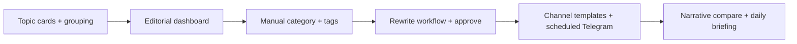

У вас уже не просто «RSS-агрегатор», а зачаток редакционной ОС: сбор → обогащение → связи → AI-углы → перепись → Telegram. Ниже — что даст максимум с точки зрения журналистики, без лишней магии.

---

## Что уже сильное (и это редкость)

- Связи и дубли — основа для «одна тема, много источников»
- Second-day angles — прямо под follow-up материалы
- Entity graph — для расследований и контекста
- Переписи с авторством — редакционный след, не безликий AI
- Telegram с маршрутизацией — уже мини-CMS дистрибуции

Дальше логично не «ещё один AI», а управление вниманием редактора и редакционный процесс.

---

## Приоритет 1 — то, что редакторы почувствуют за неделю

### 1. Редакционная лента / дашборд «что важно сейчас»

Не просто хронология, а умная очередь:

- новость упоминается в 3+ источниках за N часов → «развивается тема»
- резкий скачок тональности или частоты сущности (Трамп, ЦБ, NVIDIA)
- дубликаты сгруппированы, показывается «лучший» источник (полный текст, раньше всех)

Зачем: редактор не листает 200 RSS, а видит 10–15 поводов.

### 2. Карточка темы (Topic / Story), а не только карточка новости

Сейчас связи есть, но в UI — это пары. Нужен объект «Тема»:

- все материалы по теме (RU + ино)
- таймлайн
- ключевые сущности
- ваши переписи и что уже ушло в Telegram
- статус: мониторим / в работе / опубликовано / закрыто

Зачем: журналистика — про сюжет, не про отдельный RSS-item.

### 3. Ручная правка категории + теги редакции

Авто-категория — хорошо как черновик. Редактору нужно:

- сменить рубрику
- добавить редакционные теги (#срочно, #для-канала-X, #needs-factcheck)
- фильтровать ленту по ним

Зачем: LLM ошибается; редакция живёт своей таксономией.

### 4. Workflow публикации (минимальный)

Простая state machine для переписи/новости:

Черновик → На проверке → Одобрено → Отправлено

- кто перевёл статус и когда.

ChiefEditor — approve, Editor — draft.

Зачем: без этого Telegram-отправка — «кнопка без ответственности».

---

## Приоритет 2 — аналитика для редакции

### 5. Briefing утром / вечером (авто-сводка)

Раз в N часов LLM генерирует редакционный бриф:

- 5 главных тем дня с 2–3 источниками каждая
- что нового vs вчера
- что уже отправляли в каналы (не повториться)
- «дыры» — важная тема есть на Guardian, но нет в RU-источниках

Формат: markdown в UI + опционально в Telegram chief-редактору.

### 6. Сравнение нарративов (RU vs западные источники)

Для связанных новостей по одной теме:

- что совпадает (факты)
- где расходятся (акценты, терминология, кого называют виноватым)
- таблица «источник A говорит X, источник B — Y»

Зачем: это уже продукт для медиааналитики, не просто агрегатор.

### 7. Fact-check hints (не «истина», а подсказки)

На карточке новости:

- цифры, даты, имена → выделены для проверки
- есть ли первоисточник (официальный сайт, документ)
- перекрёстные упоминания той же цифры в других материалах

Без автоматического «правда/ложь» — только чеклист для редактора.

### 8. Улучшить topic linking ✅

Jaccard по заголовку — baseline. Реализовано:

- **embeddings** — Ollama `nomic-embed-text`, cosine similarity, хранение в `news_item_embeddings`
- **сущности** — пересечение `NamedEntityId` из `news_entity_mentions`
- **Related** — «рядом по теме» (embedding ≥ 0.65 или 2+ общих сущности)

Типы: `Duplicate` / `SameTopic` / `Related`. Методы: `TitleSimilarity`, `Embedding`, `EntityOverlap`, `Hybrid`.

---

## Приоритет 3 — производство контента

### 9. Шаблоны переписи под формат канала

Не один «перепиши новость», а пресеты:

- Telegram-кратко (до 500 зн., emoji, ссылка)
- дайджест (3–5 буллетов)
- аналитика (контекст + что будет дальше)
- нейтральная vs авторская подача

Сохранять промпты в настройках канала Telegram.

### 10. «Планировщик» публикаций

Очередь в Telegram с отложенным временем, привязка к теме, preview.

### 11. История изменений переписи

Diff версий, кто правил, откат. Для редакции это must-have, если тексты идут в канал с именем.

---

## Приоритет 4 — командная работа

| Функция | Зачем |

|---------|--------|

| Назначение на редактора («взял в работу») | Нет двойной работы |

| Комментарии к новости/теме | Обсуждение без Slack |

| Watchlist сущностей | Алерт: «новость про X» |

| Watchlist источников/регионов | Отдельные ленты для бюро |

---

## Что я бы не делал сейчас

- Полноценную CMS с фронтом для читателей — у вас другой фокус (редакция + Telegram)
- Автопубликацию без approve — риск для репутации канала
- Ещё 5 LLM-воркеров «на всякий случай» — лучше один briefing и один narrative compare
- Сложный ML для трендов — начните с правил (N источников, скачок частоты сущности)

---

## Практичный roadmap (если делать по очереди)

MVP на 2–3 итерации:

1. Темы + дашборд «горячее»
2. Ручная категория, теги, approve перед Telegram
3. Briefing + шаблоны переписи под канал

---

## Мой главный совет

Сейчас у вас сильный backend intelligence (NER, tone, links, angles), но слабее редакционная оболочка — темы, статусы, ответственность, «что важно сегодня». Журналисты не хотят «ещё один RSS»; они хотят список поводов, контекст и безопасный путь до публикации.

Если скажешь, что важнее — скорость выпуска в Telegram, аналитика, или расследования/entity graph — могу расписать конкретный MVP по сущностям, API и экранам под ваш стек.